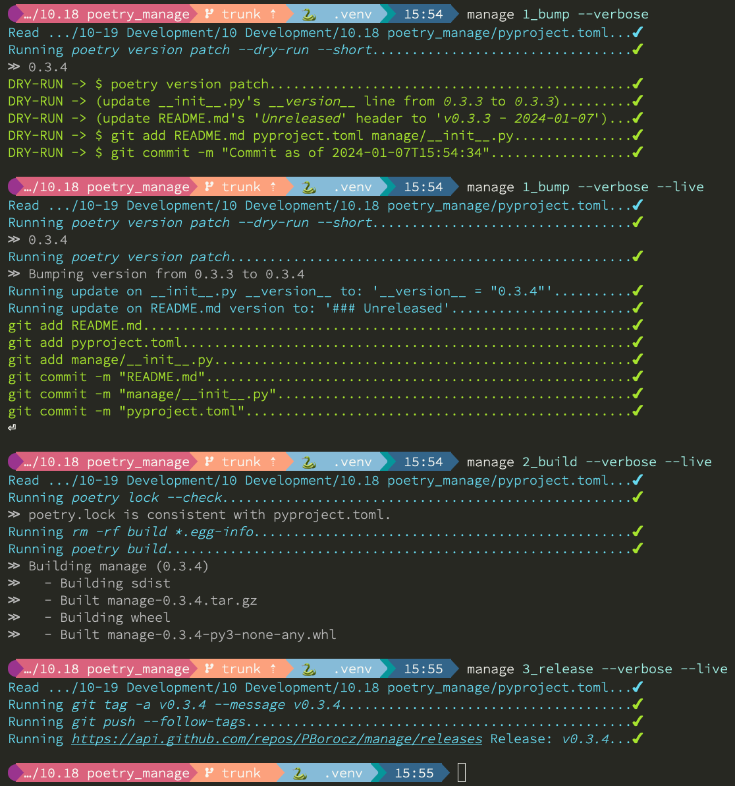

# Manage
## Introduction

In learning how to perform releases to PyPI, I became somewhat "disenchanted" by all the various manual steps and required.

In the spirit of GTD, a Makefile (or personal favorite [Justfile](https://github.com/casey/just)) was a good starting point.

However, even these left something to be desired which led me to [Thomas Feldman\'s manage.py](https://github.com/tfeldmann/organize/blob/main/manage.py) environment. I wanted to combine the best of Justfile's and Thomas' environment through a stand-alone package that I could easily apply to my myriad python projects (irrespective of whether they're released as formal packages).

Thus, this package automates all the common operations for [Poetry](https://python-poetry.org/) & README-based project/package management that I perform on a day-to-day basis. In particular, those that I don't perform regularly and/or require multiple steps to perform (and thus, tend to forget how to do!)

Here's an example of building and releasing a python package:



## Design

- Every granular command that might need to be performed on behalf of project/package management is packaged as a `method` (eg. poetry build, git commit, sass etc.)

- These granular methods are combined into `recipes` to perform a particular task (eg. build my project, update my release notes etc.)

- Recipes can be _nested_ (analogous to cooking recipes where one recipe may refer to another for a component).

- Recipes are stored in your project's `pyproject.toml` file following the `tool` section format used by other python tools. In this case, `[tool.manage]`.

- The `[tool.manage.recipes]` section contains:

    - A set of *targets* aka recipes (terminology synonymous with Makefile/Justfile targets).

    - Each target consists of a set of steps, each of which is shorthand description of what needs to be accomplished.

    - Each step can refer either to a built-in **method** (e.g. `clean`) or to the name of another *recipe*.

- Each step in a target is also configured by the following parameters:

    - Steps that have a side-effect (ie. those that can *change* something) can have a user-confirmation before executing, e.g. "Are you sure? (`confirm`).

    - Each step can be configured as to whether or not it\'s stdout is displayed (`echo_stdout`).

    - Each step can be configured control whether errors encountered are fatal or not (`allow_error`).

- Your command-line defaults can be set in the `[tool.manage.defaults]` section. For instance, if you always want to run in verbose-mode, simple set a section in your pyproject.toml like this: 

``` toml
[tool.manage.defaults]
verbose = true
```

- Other command-line defaults that can be set in this section are: `confirm`, `dry-run`/`live` (these last two are mutually-exclusive).

### Example

An example `[tool.manage]` section that defines three targets (bump a version number, clean our build environment and build our package (after cleaning) might look like this:

``` toml
################################################################################
[[tool.manage.recipes.bump]]
description = "Bump the version number to the next /patch/ level and commit locally"

[[tool.manage.recipes.bump.steps]]
method = "poetry_bump_version"

[[tool.manage.recipes.bump.steps]]
method = "update_readme"

[[tool.manage.recipes.bump.steps]]
method = "git_commit_version_files"

################################################################################
[[tool.manage.recipes.clean]]
description = "Clean out our temp files and ALL previous builds."

[[tool.manage.recipes.clean.steps]]
method = "clean"
echo_stdout = false
confirm = false
allow_error = true

################################################################################
[[tool.manage.recipes.build]]
description = "Build our distribution(s)."

[[tool.manage.recipes.build.steps]]
recipe = "clean"

[[tool.manage.recipes.build.steps]]
method = "build"
confirm = false
echo_stdout = true
allow_error = false
```

Note: If you want "non-standard" recipe names (for instance, in some projects, I like to name my recipes by the rough order of execution: 1_bump, 2_build, 3_release), you can do that by quoting the respective string:


``` toml
################################################################################
[[tool.manage.recipes."1_bump"]]
description = "Bump the version number to the next /patch/ level and commit locally"

[[tool.manage.recipes."1_bump".steps]]
method = "poetry_bump_version"

[[tool.manage.recipes."1_bump".steps]]
method = "update_readme"

[[tool.manage.recipes."1_bump".steps]]
method = "git_commit_version_files"
```

## Assumptions

This tool is based on _my_ common python project standards, allowing for the ability of this tool to work seamlessly for _me_. To the degree that your development/project/release environment strays from mine, the tool might become less relevant.

### Tools

- We assume [Git/Github](https://github.com) are used for code version management.
- We assume [poetry](https://python-poetry.org) is used to manage package dependencies **and** build environment.
- We assume that execution of this script is from the TOP level of a project, i.e. at the same level as pyproject.toml.
- We assume that **version string** in `pyproject.toml` is the **_SINGLE_** and **_CANONICAL_** version string in our project/package. Specifically, there are no `/module/__version__.py`\'s or versions embedded in `__init__.py~` files (Should you want/need to have these, it\'s certainly possible to automate the creation of them based on the version from `pyproject.toml`!).

### Versioning

- We assume the use of semantic versioning with `poetry version` to update/manage our version number. Specifically, this allows us to use `poetry version` command\'s bump rules for version updates, ie. patch, minor, major etc.

### CHANGELOG/Release History Management

- We do **not** use a stand-alone `CHANGELOG` file, instead we use a specific section in `README.org/md`. We assume that list of completed but unreleased items exist under an "**Unreleased**" header. This format provides reasonably clean automation of version/release management within the README file.

### Configuration

- We assume the following GitHub entries are available in our environment (either set in your respective shell or through .env):

| Environment Variable               | Explanation            | Example
| ---------------------------------- | ---------------------- | --------------------------------------------------------------------------------
| `GITHUB_USER`                      | User id                | `John-Jacob_JingleheimerSchmidt`
| `GITHUB_API_TOKEN`                 | Personal API token     | `ghp_1234567890ABCDEFG1234567890`
| `GITHUB_API_RELEASES`              | URL to release API     | `https://api.github.com/repos/><user>/<project>/releases`
| `GITHUB_PROJECT_RELEASE_HISTORY`   | URL to release history | `https://github.com/<user>/<project>/blob/trunk/README.org#release-history`

Note: technically, we might be able to infer `GITHUB_PROJECT_RELEASE_HISTORY` based on the `GITHUB_USER` and project name but I think we'd can infer the name of the "mainline" branch, ie. some have moved `master` to `main` while others move to `trunk`.

## Installation

This isn't packaged for PyPI. However, distribution files are released to github.

If you use `poetry`, this should suffice (and is how I use it from my projects). Specifically, we're installing the package's from it's github repository directly into our environment.

``` shell
% poetry add git+https://github.com/PBorocz/manage --group dev
```

Update your `pyproject.toml` file, here's a sample one to start from:

``` toml
# -------------------------------------------------------------------------------
[[tool.manage.recipes.clean]]
description = "Clean out our temp files and ALL previous builds."

[[tool.manage.recipes.clean.steps]]
method = "clean"
echo_stdout = false
allow_error = true

# -------------------------------------------------------------------------------
[[tool.manage.recipes.build]]
description = "Build our distribution(s)."

[[tool.manage.recipes.build.steps]]
recipe = "clean"

[[tool.manage.recipes.build.steps]]
method = "build"
confirm = false
echo_stdout = true
allow_error = false
```

At this point, you should be able to run: `% manage --print` and your `pyproject.toml` entries will be checked and validated. Note that `poetry add` will create a `manage` command into your respective python /bin environment (hopefully, your virtual env).

## Documentation
*NB: This section is **big** and should probably be moved to stand-alone documentation!*

### Command-Line Arguments

1.  --confirm

    Override any `confirm = false` entries in your pyproject.toml and force all methods with confirmation (ie. state-change) to do so.

2.  --noconfirm

    Override any `confirm = true` entries in your pyproject.toml and force all confirmation methods to **NOT** require (ie. skip) confirmation.

3.  --verbose

    Provide an extra-level of output regarding method execution (for example, including a method command's stdout stream if available)

4.  --verbose

    Provide an extra-level of output regarding method execution (for example, including a method command's stdout stream if available)

5.  --print

    Does a "pretty-print" of your recipe configuration either for either recipes or just the specific target if provided. For example:
	
``` shell
% python manage --print build

build ≫ Build our distribution(s)
[
    {
        'method': 'poetry_lock_check',
        'confirm': False,
        'verbose': False,
        'allow_error': False,
        'arguments': {}
    },
    {
        'recipe': 'clean',
        'confirm': False,
        'verbose': False,
        'allow_error': False,
        'arguments': {}
    },
    {
        'method': 'poetry_build',
        'confirm': False,
        'verbose': False,
        'allow_error': False,
        'arguments': {}
    }
]

%
```

### Common Method Options

- `confirm`: Ask for confirmation before executing the respective step, e.g. "Are you sure you want to ...?". Primarily on behalf of *write*-oriented steps, this option can be specified either on a step-by-step basis:

``` toml
[[tool.manage.recipes."1_bump".steps]]
method = "poetry_bump_version"
confirm = true
arguments = { poetry_version = "patch" }

```

- `echo_stdout`: Echo the stdout of the respective command:

``` toml
[[tool.manage.recipes.build.steps]]
method = "poetry_build"
confirm = false
echo_stdout = true
```

- `allow_error`: If True, a non-zero exit code will stop execution of the respective recipe (default is False):

``` toml
[[tool.manage.recipes.build.steps]]
method = "poetry_clean"
confirm = false
echo_stdout = true
allow_error = true
```

### Available Methods
#### Summary

| Method Name                                                           | Confirmation? | Arguments? | Arguments
|-----------------------------------------------------------------------|-----|------------|-------------
| [`clean`](#clean)														| Yes | \-         |
| [`git_add`](#git_add)													| Yes | Optional   | `pathspec`
| [`git_commit`](#git_commit)											| Yes | Optional   | `pathspec, message`
| [`git_commit_version_files`](#git_commit_version_files)				| No  | \-         |
| [`git_create_release`](#git_create_release)							| Yes | \-         |
| [`git_create_tag`](#git_create_tag)									| Yes | \-         |
| [`git_push_to_github`](#git_push_to_github)							| Yes | \-         |
| [`pandoc_convert_org_to_markdown`](#pandoc_convert_org_to_markdown)   | No  | Required   | `path_md, path_org`
| [`poetry_build`](#poetry_build)										| Yes | \-         |
| [`poetry_bump_version`](#poetry_bump_version)							| Yes | Required   | `poetry_version`
| [`poetry_lock_check`](#poetry_lock_check)								| No  | \-         |
| [`publish_to_pypi`](#publish_to_pypi)									| Yes | \-         |
| [`run_command`](#run_command)											| Yes | Required   | `command`
| [`run_pre_commit`](#run_precommit)									| No  | \-         |
| [`sass`](#sass)														| Yes | Required   | `pathspec`
| [`update_readme`](#update_readme)										| Yes | Optional   | `readme`

#### Method Details
##### **poetry_build**

- Method to "poetry" build a package distribution, ie. `poetry build`.
- This command takes **no** arguments but **will** ask for confirmation unless `--no-confirm` is set on the command-line.
- A complete example of this might be:

``` toml
[tool.manage.recipes.build]
description = "Build our distribution(s)"

[[tool.manage.recipes.build.steps]]
method = "poetry_lock_check"
confirm = false

[[tool.manage.recipes.build.steps]]
recipe = "clean"
confirm = false

[[tool.manage.recipes.build.steps]]
method = "poetry_build"
confirm = false
echo_stdout = true
```

##### **clean**

- Method to delete build artifacts, ie. `rm -rf build \*.egg-info`.
- This command takes **no** arguments but **will** ask for confirmation unless `--no-confirm` is set on the command-line (confirm: false is set on the step).

``` toml
...
[[tool.manage.recipes.<aRecipeName>.steps]]
method = "clean"
allow_errors = false
confirm = false
...
```

##### **git_add**

- Method to perform a `git add <pathspec>` operation.

``` toml
...
[[tool.manage.recipes.<aRecipeName>.steps]]
method = "git_add"
confirm = true
arguments = { pathspec = "README.md pyproject.toml" }
...
```

###### Arguments
- `pathspec` Optional path specification of dir(s) and/or file(s) to stage. Default if not specified is `.`.

##### **git_commit**

- Method to perform a `git commit <pathspec>` operation.

``` toml
...
[[tool.manage.recipes.<aRecipeName>.steps]]
method = "git_commit"
confirm = true

[[tool.manage.recipes.<aRecipeName>.steps.arguments]]
pathspec = "README.md pyproject.toml"
message ="Auto-commit"}
...
```

###### Arguments
* `pathspec` Optional path specification of dir(s) and/or file(s) to commit. Default if not specified is `.`.
* `message` Optional commit message. Default if not specified is today's date (in format: ~yyyymmddThhmm~).

##### **git_commit_version_files**

- Specialised method (really a customised version of `git_commit`) to `git stage` and `git commit` two files relevant to the build process: `pyproject.toml` and `README.(org|md)`.

- Specifically, other methods will update these files for version management and this method is provided to get them into git on behalf of a release. Alternately, you can use the more general `git_commit` method, specifying these two files to be added.

- This command takes **no** arguments but **will** ask for confirmation unless `--no-confirm` is set on the command-line.

``` toml
...
[[tool.manage.recipes.<aRecipeName>.steps]]
method = "git_commit_version_files"
confirm = true
```

##### **git_create_release**

- Method to create a git **release** using the appropriate version string (from `pyproject.toml`). This method uses the GitHub API so the environment variables listed above are required to use this method.

- This command takes **no** arguments but **will** ask for confirmation unless `--no-confirm` is set on the command-line.

``` toml
...
[[tool.manage.recipes.<aRecipeName>.steps]]
method = "git_create_release"
```

##### **git_create_tag**

- Method to create a local git **tag** using the appropriate version string (from the potentially updated `pyproject.toml`), eg. `git tag -a <version> -m <version>`
- This command takes **no** arguments but **will** ask for confirmation unless `--no-confirm` is set on the command-line.

``` toml
...
[[tool.manage.recipes.<aRecipeName>.steps]]
method = "git_create_release"
```

##### **git_push_to_github**

- Method command to perform a `git push --follow-tags`.
- This command takes **no** arguments but **will** ask for confirmation unless `--no-confirm` is set on the command-line.

``` toml
...
[[tool.manage.recipes.<aRecipeName>.steps]]
method = "git_push_to_github"
```

##### **pandoc_convert_org_to_markdown**

- Specialised method to convert an emacs .org file to a markdown (.md) file using pandoc; specifically:

```shell
pandoc -f org -t markdown --wrap none --output <path_md> <path_org>
```

``` toml
...
[[tool.manage.recipes.<aRecipeName>.steps]]
method = "pandoc_convert_org_to_markdown"
confirm = true

[[tool.manage.recipes.<aRecipeName>.steps.arguments]]
path_md = "./docs/my_doc.md"
path_org ="./docs/my_doc.org"
...
```

###### Arguments
* `path_md` Required, path specification input markdown file, e.g. `./docs/my_doc.md`.
* `path_org` Required, path specification resulting .org file to be created, e.g. `./docs/my_doc.org`.

##### **poetry_version**

- Specialised method to "bump" the version of a project/package using Poetry's version command. Takes one of three pre-defined version levels to bump and updates `pyproject.toml` with the new version value.
- A common use of this method is to provide an command-line override for the `bump_rule` to from having to edit the `pyproject.toml` file.

``` toml
...
[[tool.manage.recipes.<aRecipeName>.steps]]
method = "poetry_version"
arguments = {bump_rule: "patch"}
...
```

``` shell
% manage aRecipeName --live --bump_rule minor
```
###### Arguments
* `bump_rule` Required, the default level of version "bump" to perform. Must be one of 'patch', 'minor', 'major', 'prepatch', 'preminor', 'premajor', 'prerelease' (see [Poetry version command](https://python-poetry.org/docs/cli/#version) for more information).

##### **poetry_lock_check**

- Method to perform a poetry lock "check" to verify that `poetry.lock` is consistent with `pyproject.toml`. If it isn't, will update/refresh `poetry.lock` (after confirmation).
- This command takes **no** arguments but **will** ask for confirmation before running `poetry lock` unless `--no-confirm` is set on the command-line.

``` toml
...
[[tool.manage.recipes.<aRecipeName>.steps]]
method = "poetry_lock_check"
allow_errors = false
...
```

##### **publish_to_pypi**

- Method to publish your package to PyPI, eg. `poetry publish`.
- This command takes **no** arguments but **will** ask for confirmation unless `--no-confirm` is set on the command-line as it will update the current `poetry.lock` file.

``` toml
...
[[tool.manage.recipes.<aRecipeName>.steps]]
method = "publish_to_pypi"
allow_errors = false
```

##### **run_command**

- General method to run essentially any local command for it's respective side-effects. 
- For example, in one of my projects, I don't use the version number in `pyproject.toml` but instead in an `app/version.py` that is updated from a small script (using the date & respective branch of the last git commit performed).
- This command **will** ask for confirmation unless `--no-confirm` is set on the command-line.

```toml
...
[[tool.manage.recipes.<aRecipeName>.steps]]
method = "run_command"
allow_error = false
arguments = {command: "./app/cli/update_settings.py"}
...
```

###### Arguments
* `command` Required, a string containing the full shell command to execute.

##### **run_precommit**

- Method to run the `pre-commit` tool (if you use it), eg. `pre-commit run --all-files`
- This command takes no argument and **will** ask for confirmation unless `--no-confirm` is set on the command-line.

``` toml
...
[[tool.manage.recipes.<aRecipeName>.steps]]
method = "run_precommit"
allow_error = true
...
```

##### **sass**

- Method to run a `sass` command to convert scss to css, eg. `sass <pathSpec>`

``` toml
...
[[tool.manage.recipes.<aRecipeName>.steps]]
method = "sass"
allow_error = false
arguments = {pathspec: "./app/static/css/sass/mystyles.scss ./app/static/css/mystyles.css"}
...
```
###### Arguments
* `pathspec` Required path specification of dir(s) and/or file(s) to run.

##### **update_readme**

- Specialised method to move "Unreleased" items into a dedicated release section of a README file.
- README file can be in either [Org](https://orgmode.org/) or Markdown format, ie. `README.md` or `README.org`.
- We assume `README.org/md` is in the same directory as your `pyproject.toml` and `manage.yaml`. This is almost always the root directory of your project.
- This command **will** ask for confirmation unless `--no-confirm` is set on the command-line.

``` toml
...
# Will look for either README.org or README.md!
[[tool.manage.recipes.<aRecipeName>.steps]]
method = "update_readme"
allow_error = false
...
```

``` toml
...
# With optional argument:
[[tool.manage.recipes.<aRecipeName>.steps]]
method = "update_readme"
allow_error = false
arguments = {readme: "./subDir/README.txt"}
...
```

###### Arguments
 * `readme` Optional, a string that represents a full path to your respective README.\* file. If not specified, we search for `./README.org` and `./README.md` in the same directory as your `pyproject.toml`.

## Release History
### Unreleased
 
- CHANGED: **BREAKING!** -> Move from standalone `manage.yaml` to reading targets & recipes directly into project's respective `pyproject.toml`.

- CHANGED: **BREAKING!** -> Renamed `poetry_bump_version` method to `poetry_version` to more closely align with Poetry's command structure. Similarly, the method's argument `poetry_version` is now `bump_rule`.

- CHANGED: The `print` target is now simply a command-line flag, that runs and then exits; for example:

``` shell
# To print all recipes define in pyproject.toml:
% manage --print

# or, to print a specific recipe/target:
% manage --print build
```

- CHANGE: Added support for command-line options on behalf of methods that require arguments. For instance, the specific `poetry_version` to go "up to" was an argument setting on the respective step definition in `pyproject.toml` (eg. patch or minor). While a default value of "patch" is sufficient for most releases, if a "minor" release was required, the `pyproject.toml` argument would need to be manually changed. Now, the following will work:

``` shell
% manage build --bump_rule minor
```

Note that there are several arguments that are COMMON across methods (e.g. pathspec on behalf of `git-add`, `git-commit` and `sass`). Setting a `pathspec` value on the command-line will apply to *all* the steps run in the respective target. Let me know if this is a significant issue and I'll move to a "step-specific" approach.

- INTERNAL: Added support for pre-commit trigger and implementation of ruff (lint and format) and unimport.

- INTERNAL: Refactored ALL method implementations to class-based (didn't save as much code as expected but seems a bit cleaner).


### v0.1.11 - 2023-09-06

- FIXED: Address vulnerability of gitpython (CVE-2023-40590).

### v0.1.10 - 2023-08-17

- FIXED: Address removal of e-Tugra root certificate from certifi library (CVE-2023-37920).

### v0.1.9 - 2023-07-20

- FIXED: Add missing "main" dependency on `gitpython` (was coming implicitly from pytest-git but we need it for releases explicitly).

### v0.1.8 - 2023-07-19

- CHANGED: Removed argument "pathspec" from `git_commit`, all staged items are now committed (only argument is optional commit message).
- INTERNAL: Add more consistency obo use of `verbose` and `confirm` options.
- INTERNAL: Added tests for `git_add` and `git_commit` methods.

### v0.1.7 - 2023-07-18

- CHANGED: Removed method `poetry-lock-refresh`. The underlying command `poetry lock --no-update` will be done automatically (net of confirmation) as part of the `poetry-lock-check` method.
- CHANGED: Moved up to python 3.11 (specifically 3.11.3) to take advantage of built-in TOML support. Contact me if you think it's important to you that I support backwards compatibility with older python versions (that don't have tomllib built-in).
- CHANGED: Pulled (limited) support for method-specific command-line argument setting until we deal with method meta-data better (was only used for 1 argument: `poetry_version` to bump).
- INTERNAL: Incorporate use of [pytest-git](https://pypi.org/project/pytest-git/) to begin structured testing of git methods.

### v0.1.6 - 2023-07-15

- ADD: `sass` method to pre-process SCSS to CSS files.
- ADD: General `git_add` method to stage file(s) to local repository.
- FIX: Bug in identification of optionally-typed arguments (albeit not clear if used anywhere).

### v0.1.5 - 2023-07-12

- CHANGED: For method `update_readme`, we relaxed the requirement on finding README files. Specifically, by default, we search for either README.org or README.md and use the first one found. You can also specify a path to a README file directly with a `readme` argument to the method (ie, instead of `readme_format`).
- CHANGED: We resolved difference between the built-in targets "show" and "print". It's not "print" consistently (no more "show" option).

### v0.1.4 - 2023-07-10

- ADDED: "print" as a new built-in target (essentially just validates and prints the relevant manage.yaml command file to your terminal).
- ADDED: A simple "`git_add`" method that simply does a `git add {pathspec}` (or 'git add .' if pathspec is not provided).
- ADDED: A "`run_command`" method to run an arbitrary local command.
- CHANGED: Missing either \[tool.poetry\].version or \[tool.poetry\].package is now allowed (for those projects that don't need formal package release/build management).

### v0.1.3 - 2023-07-09

- ADDED: Two commands on behalf of poetry lock file management: `poetry_lock_check` and `poetry_lock_refresh` (meant to be used in that order) for good security practice.

### v0.1.2 - 2023-02-18

- ADDED: Command-line argument to display package' version and quit.

### v0.1.1 - 2023-02-16

### v0.1.0 - 2023-02-16

- ADDED: Support for step-specific command-line overrides. For example, when "bumping" the version number of a package, while the recipe's step may default to **patch**, we can now specify **minor** (or any of the Poetry version labels) on the command-line instead, e.g. `--poetry-version`.
- ADDED: Ability to override "confirm" recipe step attribute with command-line flag: `--no-confirm` or `--confirm`.

### v0.0.14 - 2023-02-06

- ADDED: Ability for `update_readme` to take an argument specifying what format the project's README file is in, ie. 'md' for markdown (default) or 'org'. Optional argument is `readme_format`.

### v0.0.13 - 2023-02-02

- ADDED: Ability to pass general "arguments" into steps that might require `manage.yaml` time configuration. Example is a step to convert from org to markdown, arguments are used to pass the specific input & output paths.
- CHANGED: Added ability for built-in "show" target to render nested recipes.

### v0.0.12 - 2023-02-02

- ADDED: A step method that uses pandoc converter, for example to go from README.org to README.md.
- ADDED: The first draft of a better "show" target to document the current `manage.yaml` file.
- CHANGED Corrected data model: instead of `method` or `step` for a recipe, it's now `method` or *recipe*.
- CHANGED: Moved back to dynamically importing available step methods from manage.steps module.

### v0.0.11 - 2023-01-29

- ADDED: A 'quiet-mode' step configuration option to remove all extraneous non-failure associated terminal output.
- ADDED: A command-line parameter to point to a specific manage recipe file (instead of default manage.toml)
- CHANGED: Back to YAML instead of TOML for recipe files (TOML nice for serialisation but too verbose for our use case).
- CHANGED: Default value for 'confirm' step option to True (as most of my steps are using True).
- CHANGED: To pydantic for stronger typing of Recipes and their associated steps.
- CHANGED: Sample recipe toml files to match pydantic-based data models (in particular, recipes are a dict!).

### v0.0.10 - 2023-01-26

- ADDED: A "check" recipe/option to simply run the setup & validation steps only.
- ADDED: A validation that the version in `pyproject.toml` is consistent with the last release in the Release History of `README.org`.
- CHANGED: Terminology from `target` to `recipe` and manage.toml to consisting of *recipes*.
- CHANGED: Steps to make them more "granular" and loaded from `steps` module.
- CHANGED: Over to TOML (tomli) instead of YAML for recipe files.

### v0.0.9 - 2023-01-25

- CHANGED: To catch exception when manage.yaml can't be opened.

### v0.0.8 - 2023-01-25

- ADDED: Missing /bin/manage script for execution after pip/poetry install.

### v0.0.7 - 2023-01-25

- ADDED: Assumptions and example configurations to README.org.

### v0.0.2 - 2023-01-25

- Initial packaging.

## APPENDIX: Development

If you want to help develop this, here's what might this might entail:

- Confirm python version availability, I'm developing on 3.11+ for now (and use [pyenv](https://github.com/pyenv/pyenv) to manage all my versions).

- Setup a .venv using your virtual-env manager of choice (I use `python -m venv .venv`).

- Clone the repo.

- `poetry install` to install requisite dependencies into your venv.

- Set `.envrc` to point top-level directory (i.e. README and pyproject.toml), I use the wonderful [direnv](https://direnv.net/) package to take of this housekeeping. Here's what my
`.envrc` contains, it not only sets the `PYTHON_PATH` appropriately but also takes care of automatically point me to my virtual env:

``` bash
export PYTHONPATH=`pwd`
export VIRTUAL_ENV=$PYTHONPATH/.venv
PATH_add "$VIRTUAL_ENV/bin"
```

- At this point, you should be able to run: `python manage check` against the default `manage.yaml` in the root folder (yes, I do eat my own dog-food ;-).

## APPENDIX: README Files & Formats
One of the core time-saving's feature of release automation is the stage change of outstanding items addressed in a release to a "completed" state. Since we're not assuming the use of any particular ticket tracking environment, we allow for change management tracking within a README file. Specifically:

* Tracking of closed (but not released) items in an "Unreleased" section of a README.
* Tracking of previous releases and their associated change items by date and release version.

The workflow I use is the following:

* I keep track of all items outstanding using a GTD approach, keeping this list either within a README file or another dedicated environment (usually a .ORG file).

* During development, as GTD items are addressed and committed (also tested, ruff'ed, etc..), I move their entries to the *Unreleased* section of the README file.

* Through a master "release" recipe (or set of recipes), I include the `update_readme` recipe that relabels the *Unreleased* items to the specific release version with today's date (note: doing a `poetry_bump_version` before `update_readme` is important as otherwise, an old version identifier will be used!).

README files are usually one of two formats, .org or .md. In either case, we assume that *Unreleased* appears on a line by itself (irrespective of it's header depth).

### ORG (.org) Format

A README in org format might be:

``` org
* My Project
* Stuff...
* More Stuff...
* Releases
** Unreleased
   - FIX: Made the gizmo fit into the whatchamacallit.
   - ADD: Capability to make time go backwards (required confirmation beforehand)
   - CHG: Command-line argument ~--make-me~ is now ~--confirm~.
** v1.5.10 - 2023-05-15
   - FIX: blah blah..
   ....
```

The `update_readme` recipt will use the `Unreleased` tag line and allow subsequent entries to "create" a new release (using the current version number in `pyproject.toml` and today's date), transforming the file to look like the following:

``` org
* My Project
* Stuff...
* More Stuff...
* Releases
** Unreleased
** v1.5.11 - 2023-07-12
   - FIX: Made the gizmo fit into the whatchamacallit.
   - ADD: Capability to make time go backwards (requires confirmation beforehand)
   - CHG: Command-line argument ~--make-me~ is now ~--confirm~.
   ....
** v1.5.10 - 2023-05-15
   - FIX: blah blah..
   ....
```

### Markdown (.md) Format
Similarly, a README in Markdown format might look like the following (note that the Unreleased line is at a different header level than the org-format example above!):

``` markdown
# My Project

## Stuff
    ...

## Releases

### Unreleased
    - FIX: Made the gizmo fit into the whatchamacallit.
    - ADD: Capability to make time go backwards (requires confirmation beforehand)
    - CHG: Command-line argument ~--make-me~ is now ~--confirm~.

### v1.5.10 - 2023-05-15
    - FIX: blah blah..
    ....
```

We use the `Unreleased` tag line and "create" a new release (using the current version number in `pyproject.toml` and today's date), transforming the file to look like the following:

``` markdown
# My Project

## Stuff
   ...

## Releases

### Unreleased

### v1.5.11 - 2023-07-12
    - FIX: Made the gizmo fit into the whatchamacallit.
    - ADD: Capability to make time go backwards (required confirmation beforehand)
    - CHG: Command-line argument ~--make-me~ is now ~--confirm~.

### v1.5.10 - 2023-05-15
    - FIX: blah blah..
    ....
```

